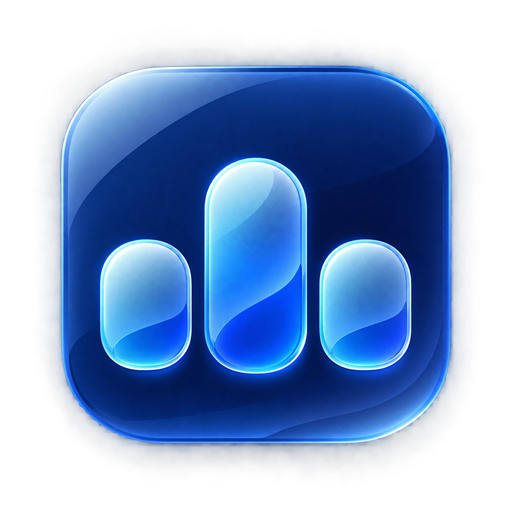
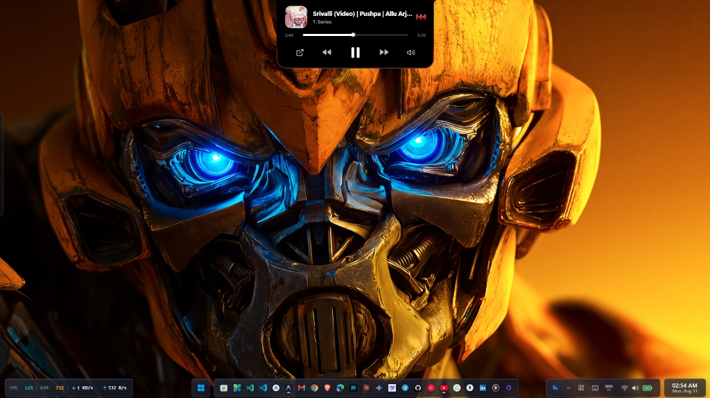
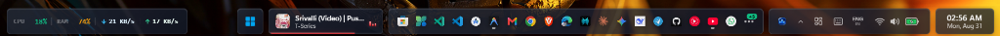
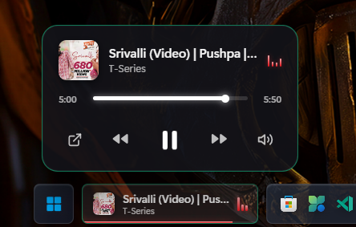
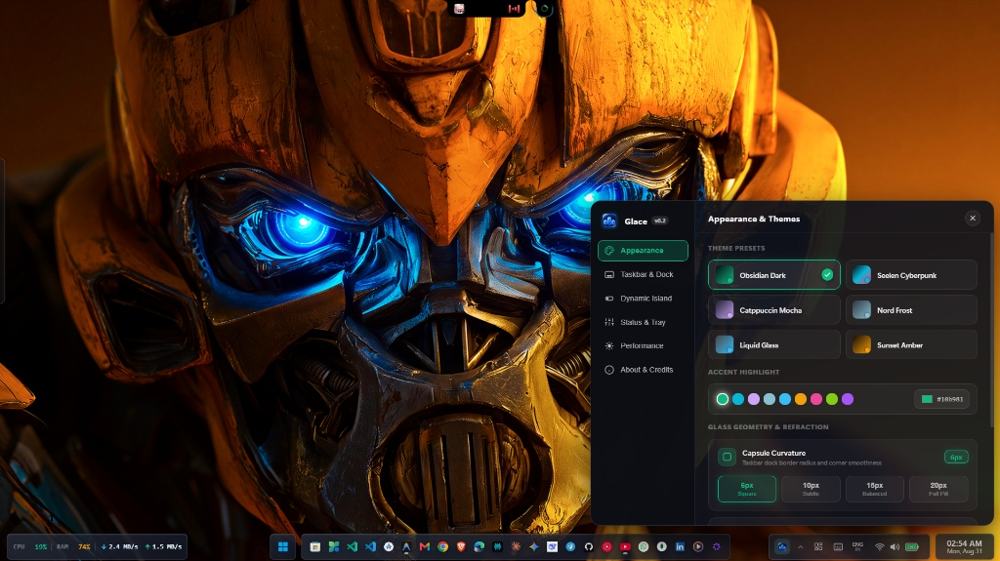
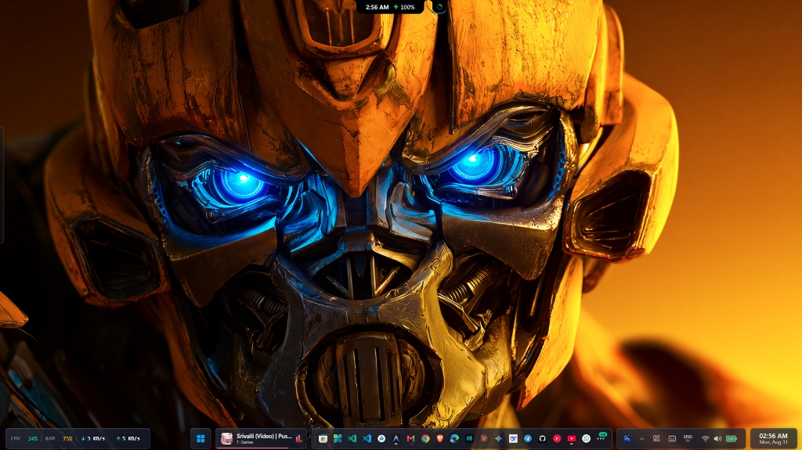

# Glace — Modern Desktop Environment & Dynamic Island for Windows

<div align="center">
  
  <p><strong>A modular, low-overhead desktop environment and dynamic island for Windows.</strong></p>
  <p>Engineered with Tauri v2, Rust, Win32 APIs, and React 19.</p>

  <p>
    <a href="https://v2.tauri.app/"></a>
    <a href="https://www.rust-lang.org/"></a>
    <a href="https://react.dev/"></a>
    <a href="https://www.typescriptlang.org/"></a>
    <a href="https://www.microsoft.com/windows"></a>
    
  </p>
</div>

---

## Visual Showcase

### Dynamic Notch & Media Integration
<div align="center">
  
</div>

<br/>

### Modular Floating Taskbar Dock
<div align="center">
  
</div>

<br/>

### Media Flyout & Appearance Settings
<table align="center" width="100%">
  <tr>
    <td width="48%" align="center" valign="top">
      <h4>Spring-Bounce Media Flyout</h4>
      
      <p align="left"><small>Clicking the taskbar capsule expands a floating controls card with interactive timeline seeking and source app launcher <code>[↗]</code>.</small></p>
    </td>
    <td width="52%" align="center" valign="top">
      <h4>Theme & Geometry Settings</h4>
      
      <p align="left"><small>Preset themes, live accent selection, and configurable glass corner curvature.</small></p>
    </td>
  </tr>
</table>

<br/>

### Split-Notch Status & Telemetry
<div align="center">
  
</div>

---

## Core Capabilities

### Dynamic Notch & Island
- **Concave Wing Geometry**: Seamless organic curvature matching modern display bezels.
- **Multi-Activity Routing**: Concurrently handles active media sessions, Bluetooth device status, and real-time hardware telemetry.
- **Animated Border Beam**: Flowing refractive light border with automatic compositor suspension during idle states to ensure 0% GPU load.
- **Interactive Scrubber & App Launcher**: Clickable timeline track with seek commands and direct focus window restoration for active players.

### Universal Media Engine
- **GSMTC + Win32 Tracking**: Integrates Windows Media Session Manager with a top-level `EnumWindows` scanner. Tracks Spotify, Apple Music, YouTube (Chrome/Edge), VLC, MPC-HC, PotPlayer, MPV, and foobar2000 even when minimized.
- **Direct WinRT Transport**: Commands (`Play/Pause`, `Next`, `Previous`) route directly through Windows OS Session IPC with fallback to virtual input hooks.
- **Dynamic HSL Palette Normalization**: Automatically extracts vibrant accent gradients from album artwork without dark brown color artifacts.
- **Spring-Physics Flyout**: 176px fixed taskbar dock with smooth spring-animated card (`cubic-bezier(0.34, 1.56, 0.64, 1)`).

### Modular Taskbar Capsules
- **Start Launcher**: Keyboard-driven app indexing, inline mathematical evaluation, and shell command execution (`> cmd`).
- **Active Applications Dock**: High-fidelity `SHGetFileInfoW` native icon extraction matching Windows Explorer with running indicators.
- **Tiling Window Management (TWM)**: Context menu window snapping (Left/Right Half, 4 Quadrants, Maximize, Center Float).
- **System Telemetry & Control Center**: Real-time network throughput, CPU utilization, RAM usage, audio controls, and quick toggles.

### Low Resource Consumption
- **Minimal Footprint**: Idles at **~25–35 MB RAM**, significantly lower than the default Windows 11 taskbar stack.
- **Zero-GPU Compositor Sleep**: Suspends CSS keyframes and filter operations when the desktop is calm, waking immediately upon events.
- **Non-Destructive Taskbar Suppression**: Reversible `Shell_TrayWnd` hook that reserves desktop work areas with automatic fail-safe restoration on process termination.

---

## Architecture

```
┌─────────────────────────────────────────────────────────────┐
│                    REACT 19 FRONTEND                        │
│   DynamicIsland (Notch)   │   Modular Taskbar Capsules     │
│   • useMediaSession       │   • Window Snapping Menu        │
│   • useBluetooth          │   • Start Launcher & Calc       │
│   • useSystemMetrics      │   • Glassmorphic Design System  │
└──────────────────────────────┬──────────────────────────────┘
                               │ Tauri IPC Bridge (JSON)
┌──────────────────────────────▼──────────────────────────────┐
│                    TAURI v2 RUST CORE                       │
│  ┌──────────────────────┐        ┌───────────────────────┐  │
│  │     Media Host       │        │    Window Watcher     │  │
│  │ • WinRT GSMTC Session│        │ • WinEventHook Scanner│  │
│  │ • EnumWindows Scan   │        │ • Shell_TrayWnd Suppr │  │
│  │ • Wall-Clock Sync    │        │ • SHGetFileInfoW Icons│  │
│  └──────────────────────┘        └───────────────────────┘  │
│  ┌──────────────────────┐        ┌───────────────────────┐  │
│  │    SysInfo Engine    │        │      Tray / Win32     │  │
│  │ • CPU & RAM Polling  │        │ • System Tray Host    │  │
│  │ • Battery & BT Stats │        │ • WorkArea Automanage │  │
│  └──────────────────────┘        └───────────────────────┘  │
└─────────────────────────────────────────────────────────────┘
```

---

## Tech Stack

| Layer | Technologies |
| :--- | :--- |
| **Runtime Framework** | [Tauri v2](https://v2.tauri.app/) (Rust + Microsoft WebView2) |
| **Frontend UI** | React 19, TypeScript, Vanilla CSS Design System |
| **System Layer** | Windows WinRT (`windows-rs` 0.61), Win32 API, GSMTC |
| **Styling & Motion** | Pure CSS Variables, Liquid Glassmorphism, Spring Easing Functions |
| **Build System** | Vite, Cargo, PowerShell Scripts |

---

## Getting Started

### Prerequisites

- **Node.js** (v18 or higher) — [Download](https://nodejs.org/)
- **Rust & Cargo** — [Install Rust](https://www.rust-lang.org/tools/install)
- **Visual Studio C++ Build Tools** (Desktop development with C++) — [Download](https://visualstudio.microsoft.com/visual-cpp-build-tools/)

### Development

```powershell
# 1. Clone the repository
git clone https://github.com/Uchiha-Itachi001/Glace.git
cd Glace

# 2. Install dependencies
npm install

# 3. Start development server
$env:Path = "$env:USERPROFILE\.cargo\bin;$env:Path"
npm run tauri dev
```

### Production Build

To build the optimized native Windows binary (`.exe` / `.msi`):

```powershell
npm run tauri build
```

Generated outputs are placed in `src-tauri/target/release/bundle/`.

---

## Controls & Shortcuts

| Action | Input |
| :--- | :--- |
| Toggle Quick Start Launcher | `Win + Space` |
| Expand Notch / Capsule Card | Left Click on Notch or Capsule |
| Volume Adjust | Scroll Wheel over Dynamic Notch |
| Window Snapping Menu | Right Click on any Taskbar App Icon |
| Timeline Seeking | Click on Scrubber Track |
| Focus Playing App | Click `[↗]` Button in Media Controls |

---

## Built-in Themes

- **Obsidian Dark**: High-contrast OLED dark background with luminous cyan/magenta accents.
- **Seelen Cyberpunk**: Vibrant yellow and electric purple highlights.
- **Catppuccin Mocha**: Pastel mauve, blue, and peach palette.
- **Nord Frost**: Minimalist arctic slate and white tones.
- **Liquid Glass**: Translucent frosted blur with refractive light borders.
- **Sunset Amber**: Warm gradient tones with golden orange accents.

---

## License

MIT License. Copyright (c) 2026.
