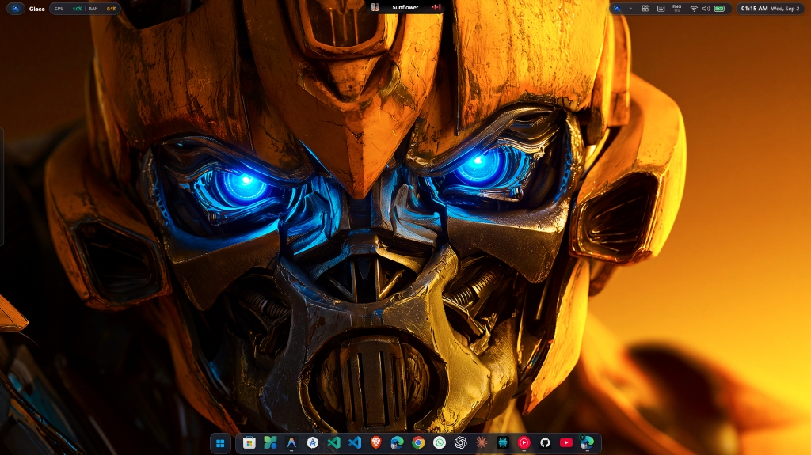
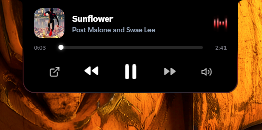
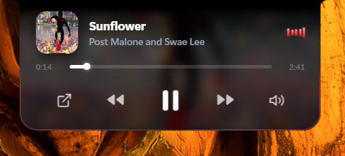
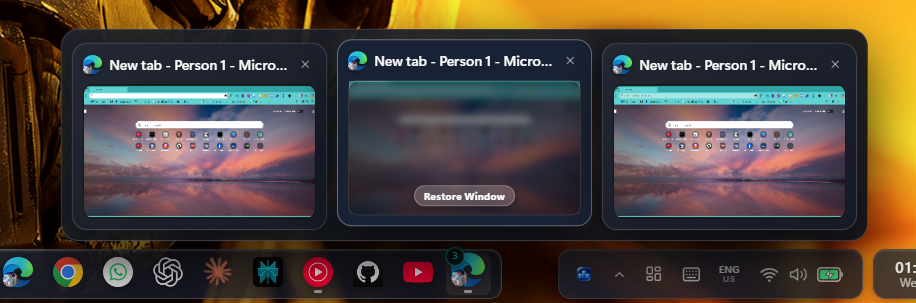

# Glace — Modern Desktop Environment & Dynamic Island for Windows

<div align="center">
  
  
  <h3>A modular, ultra-lightweight desktop environment & dynamic island for Windows.</h3>
  <p>Engineered with Tauri v2, Rust, Win32 / WinRT APIs, and React 19.</p>

  <p>
    <a href="https://v2.tauri.app/"></a>
    <a href="https://www.rust-lang.org/"></a>
    <a href="https://react.dev/"></a>
    <a href="https://www.typescriptlang.org/"></a>
    <a href="https://www.microsoft.com/windows"></a>
    
  </p>

  <p>
    <code>⚡ ~25–35 MB RAM Idle</code> &nbsp;•&nbsp;
    <code>🔋 0% GPU Idle Sleep</code> &nbsp;•&nbsp;
    <code>🎵 GSMTC + Win32 Media</code> &nbsp;•&nbsp;
    <code>🪟 Live DWM Thumbnails</code> &nbsp;•&nbsp;
    <code>📊 Live Network Speeds</code>
  </p>
</div>

---

## 🌟 Visual Showcase

<div align="center">
  
  <p><sub>Dynamic Island in action — expanded notch with live media session, album artwork extraction, animated waveform visualizer, and interactive scrubber.</sub></p>
</div>

<br/>

### macOS Bar Layout
<div align="center">
  
  <p><sub>Glace in macOS top-bar mode — unified status bar housing the Dynamic Island, system tray host, clock, and hardware telemetry all along the top edge of the display.</sub></p>
</div>

<br/>

### Dynamic Island Media Presentation Modes
<table align="center" width="100%">
  <tr>
    <td width="50%" align="center" valign="top">
      <h4>🖤 Solid OLED Black (Default)</h4>
      
      <p align="left"><sub>Pure pitch-black OLED background with animated audio visualizer bars, high-contrast typography, and source-app launcher <code>[↗]</code>.</sub></p>
    </td>
    <td width="50%" align="center" valign="top">
      <h4>🎨 Dynamic Album Art Backdrop</h4>
      
      <p align="left"><sub>Immersive blurred album cover fill with calibrated saturation and legibility tint. Top curve ear preserved for seamless bezel blending.</sub></p>
    </td>
  </tr>
</table>

<br/>

### Modular Floating Taskbar Dock
<div align="center">
  
  <p><sub>Segmented liquid glass capsule dock — from left to right: Start launcher, active apps with native icons, system tray host, and a live telemetry pill showing real-time CPU %, RAM %, and network upload/download speeds. All capsules support hover lift animations with spring-physics.</sub></p>
</div>

<br/>

### Multi-Window Live Thumbnail Previews
<div align="center">
  
  <p><sub>High-fidelity live DWM thumbnail previews for multi-instance applications — hover to preview, click to focus, or dismiss a window directly from the card.</sub></p>
</div>

<br/>

### Media Flyout & Appearance Hub
<table align="center" width="100%">
  <tr>
    <td width="48%" align="center" valign="top">
      <h4>🎛️ Spring Media Flyout</h4>
      
      <p align="left"><sub>Clicking the taskbar media capsule spawns a spring-physics floating card with full transport controls, interactive timeline scrubbing, and quick app-focus.</sub></p>
    </td>
    <td width="52%" align="center" valign="top">
      <h4>🎨 Appearance & Theme Customizer</h4>
      
      <p align="left"><sub>Curated preset themes, live accent color generator, glass corner curvature, and notch background style — all applied instantly without restart.</sub></p>
    </td>
  </tr>
</table>

<br/>

### Desktop Idle — Split-Notch Status
<div align="center">
  
  <p><sub>During idle, the notch splits subtly to show battery health, charging state, and connected Bluetooth device status — no full expansion needed.</sub></p>
</div>

---

## ✨ Feature Overview

### 🏝️ Dynamic Island & Notch
- **Concave Wing Geometry** — pixel-perfect organic curvature matching modern display bezels.
- **Multi-Activity Routing** — concurrently surfaces media sessions, Bluetooth state, and hardware telemetry.
- **Animated Border Beam** — refractive light border with automatic GPU compositor sleep at **0% load**.
- **OLED Black / Album Art Modes** — toggle between pure `#000000` black and immersive blurred album artwork.
- **Interactive Scrubber** — clickable seek track with direct focus restoration to the active player window.

### 🎵 Universal Media Engine
- **GSMTC + Win32 Tracking** — tracks Spotify, Apple Music, YouTube (Chrome/Edge/Brave), VLC, MPC-HC, PotPlayer, MPV, and foobar2000 even when minimized.
- **Direct WinRT Transport** — `Play/Pause/Next/Prev` commands route through Windows OS Session IPC with virtual-input fallback.
- **HSL Palette Extraction** — extracts vibrant accent gradients from album art without muddy brown color artifacts.
- **Spring-Physics Card** — `cubic-bezier(0.34, 1.56, 0.64, 1)` spring easing on flyout expansion.

### 🚀 Modular Taskbar Capsules
- **Start Launcher** — keyboard-indexed app search, inline math evaluation, and shell passthrough (`> cmd`).
- **Native Icon Dock** — `SHGetFileInfoW` icon extraction matching Windows Explorer fidelity, with running indicators and instance badges.
- **Live DWM Thumbnail Previews** — multi-instance window cards with persistent in-memory snapshot cache for minimized apps.
- **Tiling Window Management** — snap to Left/Right Half, 4 Quadrants, Maximize, or Center Float via right-click context menu.
- **Telemetry Pill** — real-time CPU %, RAM %, and upload/download network throughput inline in the dock.

### ⚡ Resource-Conscious Architecture
- **~25–35 MB RAM idle** — significantly lower than the default Windows 11 taskbar stack.
- **Zero-GPU compositor sleep** — CSS keyframes and backdrop-filter suspended when desktop is calm.
- **Non-destructive taskbar suppression** — reversible `Shell_TrayWnd` hook with automatic work-area restoration on exit.

---

## 🏛️ Architecture

```
┌─────────────────────────────────────────────────────────────┐
│                    REACT 19 FRONTEND                        │
│   DynamicIsland (Notch)   │   Modular Taskbar Capsules     │
│   • useMediaSession       │   • Window Snapping & Previews  │
│   • useBluetooth          │   • Start Launcher & Calc       │
│   • useSystemMetrics      │   • Glassmorphic Design System  │
└──────────────────────────────┬──────────────────────────────┘
                               │ Tauri IPC Bridge (JSON)
┌──────────────────────────────▼──────────────────────────────┐
│                    TAURI v2 RUST CORE                       │
│  ┌──────────────────────┐        ┌───────────────────────┐  │
│  │     Media Host       │        │    Window Watcher     │  │
│  │ • WinRT GSMTC Session│        │ • WinEventHook Scanner│  │
│  │ • EnumWindows Scan   │        │ • Shell_TrayWnd Suppr │  │
│  │ • Wall-Clock Sync    │        │ • SHGetFileInfoW Icons│  │
│  └──────────────────────┘        └───────────────────────┘  │
│  ┌──────────────────────┐        ┌───────────────────────┐  │
│  │    SysInfo Engine    │        │      Tray / Win32     │  │
│  │ • CPU & RAM Polling  │        │ • System Tray Host    │  │
│  │ • Network Bandwidth  │        │ • Live DWM Thumbnails │  │
│  │ • Battery & BT State │        │ • WorkArea Automanage │  │
│  └──────────────────────┘        └───────────────────────┘  │
└─────────────────────────────────────────────────────────────┘
```

---

## 🛠️ Tech Stack

| Layer | Technology |
| :--- | :--- |
| **Runtime** | [Tauri v2](https://v2.tauri.app/) — Rust core + Microsoft WebView2 renderer |
| **Frontend** | React 19, TypeScript 5.6, Vanilla CSS Design System |
| **System APIs** | `windows-rs` 0.61 — WinRT, Win32, GSMTC, DWM, Shell |
| **Motion** | CSS spring variables, `cubic-bezier` physics, `backdrop-filter` compositor |
| **Build** | Vite 7, Cargo, PowerShell automation scripts |

---

## 🚀 Getting Started

### Prerequisites

| Tool | Minimum Version | Install |
| :--- | :--- | :--- |
| **Node.js** | v18+ | [nodejs.org](https://nodejs.org/) |
| **Rust** | 1.80+ | [rustup.rs](https://rustup.rs/) |
| **VS Build Tools** | 2022 | [visualstudio.microsoft.com](https://visualstudio.microsoft.com/visual-cpp-build-tools/) |

> **Windows 10 / 11** required. Install **Desktop development with C++** workload in VS Build Tools.

### Clone & Run

```powershell
git clone https://github.com/Uchiha-Itachi001/Glace.git
cd Glace
npm install

# Start dev server
$env:Path = "$env:USERPROFILE\.cargo\bin;$env:Path"
npm run tauri dev
```

### Production Build

```powershell
npm run tauri build
# → src-tauri/target/release/bundle/
```

---

## ⌨️ Shortcuts

| Action | Input |
| :--- | :--- |
| Toggle Start Launcher | `Win + Space` |
| Expand Dynamic Notch | Left-click on notch |
| Expand Taskbar Capsule | Left-click on capsule |
| Volume Control | Scroll wheel over notch |
| Window Snap Menu | Right-click any app icon |
| Timeline Seek | Click / drag scrubber |
| Focus Active Player | `[↗]` button in media card |

---

## 🎨 Themes

| Theme | Description |
| :--- | :--- |
| **Obsidian Dark** | OLED black with luminous cyan & magenta accents |
| **Seelen Cyberpunk** | Vibrant electric yellow & purple |
| **Catppuccin Mocha** | Pastel mauve, blue, and peach |
| **Nord Frost** | Arctic slate & white minimalism |
| **Liquid Glass** | Translucent frosted blur with refractive borders |
| **Sunset Amber** | Warm golden orange gradient tones |

---

## 📄 License

MIT License © 2026
